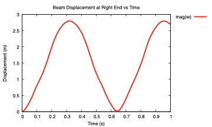

# 3-D Dynamic Cantilever

[Open the runnable case in the beamFoam repository](https://github.com/solids4foam/beamFoam/tree/main/tutorials/3DdynamicCantilever).

## Tutorial Aims

This tutorial demonstrates how to:

- simulate the large-deformation vibration of a three-dimensional cantilever
- create a beam mesh and rotate it into its initial vertical configuration
- apply a time-dependent end force and zero end moment
- use the implicit Newmark time-integration scheme
- compare mesh and time-step sensitivity against reference solutions
- extract displacement, force, convergence and energy histories

The case is the first benchmark presented in the
[beamFoam paper](https://doi.org/10.51560/ofj.v5.170).

## Prerequisites

- A compiled beamFoam installation
- A sourced, supported OpenFOAM.com environment
- gnuplot with the `pdfcairo` terminal for generating the supplied plots
- ParaView for visualising the deformed beam

The default case uses OpenFOAM's implicit Newmark scheme, a time step of
`0.001 s`, and 20 beam segments.

## Problem Description

A cantilever column with a square cross-section is clamped at its lower end and
subjected to a sudden constant force at its upper end. The force acts from
`t = 0 s` until the simulation ends at `t = 1 s`, producing large
three-dimensional deformation and vibration.

The benchmark compares the one-dimensional beamFoam model against detailed
three-dimensional solids4Foam and ABAQUS solutions.

| Property | Value |
| --- | ---: |
| Length | `2 m` |
| Cross-section | `0.2 m x 0.2 m` square |
| Young's modulus | `15.293 MPa` |
| Shear modulus | `5.882 MPa` |
| Poisson's ratio | approximately `0.3` |
| Density | `1000 kg/m^3` |
| Applied end force | `(2000 2000 0) N` |
| Default mesh | `20` beam segments |
| End time | `1 s` |
| Default time step | `0.001 s` |

The first bending period is approximately `1 s`. The paper recommends resolving
this period with at least 20 to 50 points, corresponding to a time step of
approximately `0.02 s` or smaller.

## Case Setup

### Beam Geometry and Material

The beam definition is stored in `constant/beamProperties`:

```c++
beamModel coupledTotalLagNewtonRaphsonBeam;

beams
(
    beam_0
    {
        crossSectionModel rectangle;

        rectangleCrossSectionModelDict
        {
            b 0.2;
            h 0.2;
            nx 1;
            ny 1;
        }

        length      2;
        nSegments   20;
        E           15.293e6;
        G           5.882e6;
        rho         1000;
    }
);
```

`createBeamMesh` initially creates the beam along the global x-axis. The
`Allrun` script then rotates `beam_0` by 90 degrees about the negative y-axis:

```bash
setInitialPositionBeam \
    -cellZone beam_0 \
    -translate '(0 0 0)' \
    -rotateAngle '((0 -1 0) 90)'
```

### Boundary Conditions and Loading

The `left` patch represents the clamped lower end:

- `0/W`: `fixedValue` displacement
- `0/Theta`: `fixedValue` rotation

The `right` patch represents the loaded upper end:

- `0/W`: `forceBeamDisplacementNR`, reading
  `constant/timeVsForce`
- `0/Theta`: `momentBeamRotationNR`, reading the zero-moment history in
  `constant/timeVsMoment`

The applied force history is:

```c++
(
    (0 (2000 2000 0))
    (1 (2000 2000 0))
)
```

### Time Integration and Output

`system/fvSchemes` selects the implicit Newmark method for the first- and
second-time derivatives. `system/controlDict` defines `deltaT`, the end time,
write frequency and the following function objects:

- `beamDisplacements`: displacement history at the `right` patch
- `beamForcesMoments`: force and moment history at the `left` patch
- `beamConvergenceData`: nonlinear convergence history
- `beamEnergyData`: internal, kinetic and total energy histories

## Running the Tutorial

From this tutorial directory:

```bash
./Allclean
./Allrun
```

The script performs:

1. `createBeamMesh`
2. `setInitialPositionBeam`
3. `beamFoam`
4. `gnuplot allPlots.gnuplot`

The main generated files are:

- `log.createBeamMesh`
- `log.setInitialPositionBeam`
- `log.beamFoam`
- `displacementPlot.pdf`
- `energyPlot.pdf`
- `postProcessing/0/beamDisplacements_right.dat`
- `postProcessing/0/beamEnergyData.dat`

## Post-Processing

To inspect the deformed column:

```bash
touch case.foam
paraview case.foam
```

Apply **Warp By Vector** using `pointW`. The upper end should undergo a large
oscillatory displacement and can fall below its initial base level during the
motion.

`displacementPlot.pdf` shows the displacement magnitude at the loaded end.
`energyPlot.pdf` shows the internal, kinetic and total energy histories.



## Expected Results

The paper reports that:

- approximately four Newton iterations are required per time step
- even a five-segment beam gives a response close to the reference results
- the 20-segment result converges closely to solids4Foam and ABAQUS
- Newmark captures the oscillatory response more accurately than backward Euler
  for a given time step
- time steps of `0.01 s` and `0.001 s` closely match the reference response

Reference displacement histories from solids4Foam and ABAQUS are supplied in
`solidPointDisplacement_pointDisp.dat` and
`cantilever_abaqus_50percent.txt`.

The execution times reported in the paper were obtained on an Apple M1 Pro and
should be treated as comparative reference values rather than acceptance
criteria:

| Model | Execution time |
| --- | ---: |
| beamFoam, 5 segments | `0.89 s` |
| beamFoam, 10 segments | `1.01 s` |
| beamFoam, 20 segments | `1.26 s` |
| solids4Foam JFNK | `12156 s` |
| ABAQUS C3D8 | `9240 s` |

## Mesh Sensitivity Study

Run:

```bash
./runSweep.sh
```

The script runs meshes with 5, 10, 20 and 40 segments. It writes:

- `timing_summary.txt`
- displacement histories under `dispResults/`
- `dispPlotVaryingMesh.pdf`

The script modifies `nSegments` in `constant/beamProperties` and leaves the
last tested value in place. Restore the default value of `20` before running
the standard case again.

## Time-Step Sensitivity Study

Keep the Newmark scheme selected in `system/fvSchemes`, then run:

```bash
./runTimeSweep.sh
```

The script tests `deltaT = 0.1`, `0.05`, `0.01` and `0.001 s`. It writes:

- `dt_timing_summary.txt`
- displacement histories under `dispResultsTime/`
- `dispPlotVaryingDT.pdf`

The script modifies `deltaT` and `writeInterval` in `system/controlDict` and
leaves the last tested values in place.

To investigate backward Euler, change both defaults in `system/fvSchemes` from
`Newmark` to `Euler` before running the sweep. Coarse Euler time steps introduce
substantial numerical damping.

## Troubleshooting

- If `createBeamMesh` or `beamFoam` is not found, source OpenFOAM and rebuild
  beamFoam.
- If the beam remains horizontal, inspect
  `log.setInitialPositionBeam` for errors.
- If plotting fails, confirm that gnuplot supports the `pdfcairo` terminal. The
  solver results remain available under `postProcessing/`.
- Run `./Allclean` before repeating the standard case after a sensitivity
  study.

## References

- Bali, S., Taran, A., Tuković, Ž., Pakrashi, V., and Cardiff, P. (2025).
  *beamFoam: A Cell-Centred Finite Volume Solver for Nonlinear
  Geometrically-Exact Beams in OpenFOAM*. OpenFOAM Journal, 5, 180-210.
- Cardiff, P., et al. (2025). *A Jacobian-Free Newton-Krylov Method for
  Cell-Centred Finite Volume Solid Mechanics*.
