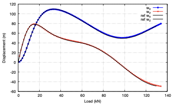

# In-Plane Cantilever Subjected to an End Follower Load

[Open the runnable case in the beamFoam repository](https://github.com/solids4foam/beamFoam/tree/main/tutorials/cantileverFollowerForce).

## Tutorial Aims

This tutorial demonstrates how to:

- simulate a geometrically nonlinear quasi-static beam problem
- apply a non-conservative circulatory follower force
- use pseudo-time to increment a static load
- compare free-end displacements with literature reference results
- perform a mesh sensitivity study

The case is the second benchmark presented in the
[beamFoam paper](https://doi.org/10.51560/ofj.v5.170).

## Prerequisites

- A compiled beamFoam installation
- A sourced, supported OpenFOAM.com environment
- gnuplot with the `pdfcairo` terminal for generating the supplied plots
- ParaView for visualising the deformed beam

## Problem Description

A straight cantilever is clamped at its left end and subjected to a circulatory
follower force at its right end. Unlike a force with a fixed global direction,
the follower force rotates with the instantaneous end configuration. It is
therefore configuration-dependent and non-conservative.

The load is increased linearly from zero to `134 kN` over 1000 pseudo-time
increments. Both time-derivative schemes are set to `steadyState`, so pseudo-time
controls load incrementation rather than physical dynamics.

| Property | Value |
| --- | ---: |
| Length | `100 m` |
| Cross-section | circular |
| Radius | `0.65828153 m` |
| Young's modulus | `2.3731844e8 Pa` |
| Shear modulus | `1.1865922e8 Pa` |
| Maximum follower force | `134 kN` |
| Default mesh | `40` beam segments |
| Pseudo-time step | `0.001` |
| Number of load increments | `1000` |

The corresponding rigidities are approximately:

- flexural rigidity: `EI = 3.5e7 Nm^2`
- shear rigidity: `GA = 1.61538e8 N`

## Case Setup

### Beam Geometry and Nonlinear Controls

`constant/beamProperties` defines the circular beam and the nonlinear
solution controls:

```c++
beams
(
    beam_0
    {
        crossSectionModel circle;

        circleCrossSectionModelDict
        {
            radius 0.65828153;
        }

        length      100;
        nSegments   40;
        E           2.3731844e8;
        G           1.1865922e8;
    }
);

beamModel coupledTotalLagNewtonRaphsonBeam;
```

The model uses:

- `nCorrectors 1000`
- `solutionTol 1e-10`
- `residualTol 1e-8`

### Boundary Conditions and Loading

The `left` patch is clamped:

- `0/W`: zero fixed displacement
- `0/Theta`: zero fixed rotation

At the `right` patch:

- `0/W` uses `followerForceBeamDisplacementNR`
- `0/Theta` uses `momentBeamRotationNR` with a zero applied moment

The follower force is read from `constant/timeVsFollowerForce`:

```c++
(
    (0 (0 0 0))
    (1 (0 0 1.34e5))
)
```

The force direction is updated as the free-end configuration changes. This
boundary condition is the defining feature of the benchmark.

### Quasi-Static Solution and Output

`system/fvSchemes` selects `steadyState` for both time-derivative schemes.
`system/controlDict` advances from pseudo-time `0` to `1` with `deltaT = 0.001`.

The enabled function objects write:

- right-end displacement history
- left-end resultant force and moment history
- nonlinear convergence information

## Running the Tutorial

From this tutorial directory:

```bash
./Allclean
./Allrun
```

The script creates the beam mesh, runs beamFoam and generates
`displacementPlot.pdf`.

The principal output files are:

- `log.createBeamMesh`
- `log.beamFoam`
- `displacementPlot.pdf`
- `postProcessing/0/beamDisplacements_right.dat`

The default plot compares the calculated free-end displacement components
against `referenceResultsSimo.dat`.

## Post-Processing

To inspect the changing beam configuration:

```bash
touch case.foam
paraview case.foam
```

Apply **Warp By Vector** using `pointW`. Inspect multiple pseudo-time
directories to see how the beam direction and follower-force direction evolve
as the load increases.

The displacement history contains the free-end components. `allPlots.gnuplot`
combines this history with `AppliedLoad.dat` to plot displacement against load.

## Expected Results

The paper reports:

- good agreement with the Simo and Vu-Quoc reference solution
- approximately four to six Newton iterations per load increment
- closer agreement with the reference solution as the mesh is refined
- second-order spatial convergence of the final free-end displacement

The important validation quantities are the in-plane free-end displacement
components `w_x` and `w_z` as the load increases to `134 kN`.



## Mesh Sensitivity Study

Run:

```bash
./runSweep.sh
```

The script runs meshes with 5, 10, 20 and 40 segments. It writes:

- `timing_summary.txt`
- displacement histories under `dispResults/`
- `AppliedLoad.dat`
- `dispComparison_Wx_MeshSizes.pdf`
- `dispComparison_Wz_MeshSizes.pdf`

The script generates `AppliedLoad.dat` from the 20-segment displacement history
and compares the mesh results with `referenceResultsSimo.dat`.

The sweep modifies `nSegments` in `constant/beamProperties` and leaves the last
tested value, `40`, in place.

The beamFoam paper additionally reports a convergence study using 10, 20, 40
and 80 control volumes. Extend the `mesh_sizes` list in `runSweep.sh` if the
80-segment result is required.

## Troubleshooting

- If the force behaves as a fixed global load, confirm that `0/W` uses
  `followerForceBeamDisplacementNR`, not `forceBeamDisplacementNR`.
- If the load-displacement plot fails, confirm that
  `postProcessing/0/beamDisplacements_right.dat` exists and that gnuplot can
  find `AppliedLoad.dat` and `referenceResultsSimo.dat`.
- If nonlinear convergence deteriorates near the final load, reduce `deltaT`
  to use smaller load increments.
- Run `./Allclean` before repeating the standard case after changing the mesh.

## References

- Bali, S., Taran, A., Tuković, Ž., Pakrashi, V., and Cardiff, P. (2025).
  *beamFoam: A Cell-Centred Finite Volume Solver for Nonlinear
  Geometrically-Exact Beams in OpenFOAM*. OpenFOAM Journal, 5, 180-210.
- Argyris, J., et al. (1981). *Nonlinear Finite Element Analysis of Elastic
  Systems under Nonconservative Loading: Natural Formulation. Part I:
  Quasistatic Problems*.
- Simo, J. C., and Vu-Quoc, L. (1986). *A Three-Dimensional Finite-Strain Rod
  Model. Part II: Computational Aspects*. Computer Methods in Applied Mechanics
  and Engineering, 58, 79-116.
