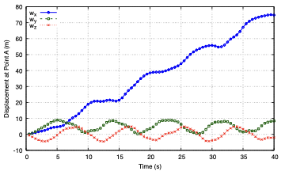

# Free Flexible Beam: Kayak-Rowing Motion

[Open the runnable case in the beamFoam repository](https://github.com/solids4foam/beamFoam/tree/main/tutorials/freeFlexibleBeam).

## Tutorial Aims

This tutorial demonstrates how to:

- simulate the strongly coupled three-dimensional motion of a free beam
- rotate a beam into a non-axis-aligned initial configuration
- apply time-dependent force and moment boundary conditions at a free end
- transition from forced motion to free vibration
- assess energy conservation with the Newmark time-integration scheme

The case is the third benchmark presented in the
[beamFoam paper](https://doi.org/10.51560/ofj.v5.170).

## Prerequisites

- A compiled beamFoam installation
- A sourced, supported OpenFOAM.com environment
- gnuplot with the `pdfcairo` terminal for generating the supplied plots
- ParaView for visualising the three-dimensional motion

The default case uses 10 beam segments, the Newmark scheme, `deltaT = 0.01 s`
and an end time of `40 s`.

## Problem Description

An initially straight beam is inclined in the global xy-plane. Both ends are
free, and a force and combined bending moment are applied at endpoint A, the
`right` patch, until `t = 2.5 s`. The loads are then removed and the beam
continues in free vibration.

The nonlinear interaction of bending in two planes with forward motion causes
the free ends to trace paddle-like trajectories. This characteristic response
is commonly called the kayak-rowing motion.

| Property | Value |
| --- | ---: |
| Length | `10 m` |
| Cross-section | circular |
| Radius | `0.44721360 m` |
| Density | `1.5915466 kg/m^3` |
| Young's modulus | `1.5915494e4 Pa` |
| Shear modulus | `1.5915494e4 Pa` |
| Initial rotation | `53.130102 degrees` about negative z |
| Right-end force for `0 <= t <= 2.5 s` | `(8 0 0) N` |
| Right-end moment magnitude | `80 Nm` |
| Default mesh | `10` beam segments |
| Default time step | `0.01 s` |
| End time | `40 s` |

The selected cross-section and material properties correspond to:

- `EA = GA = 1e4 N`
- `EI = 500 Nm^2`
- `A rho = 1 kg/m`
- prescribed rotary inertia `I_2 rho = I_3 rho = 10 kg m`

An artificial rotary-inertia scaling factor of `200.39427` is used to reproduce
the benchmark inertia.

## Case Setup

### Beam Geometry and Initial Position

`constant/beamProperties` defines the circular beam, material properties and
inertia scaling:

```c++
beamModel coupledTotalLagNewtonRaphsonBeam;

beams
(
    beam_0
    {
        crossSectionModel circle;

        circleCrossSectionModelDict
        {
            radius 0.44721360;
        }

        length      10;
        nSegments   10;
    }
);
```

After `createBeamMesh`, the `Allrun` script rotates the beam into its inclined
initial configuration:

```bash
setInitialPositionBeam \
    -cellZone beam_0 \
    -translate '(0 0 0)' \
    -rotateAngle '((0 0 -1) 53.130102)'
```

### Boundary Conditions and Loading

Both ends use Neumann boundary conditions:

- `0/W` uses `forceBeamDisplacementNR` on the `left` and `right` patches
- `0/Theta` uses `momentBeamRotationNR` on the `left` and `right` patches

Endpoint B, the `left` patch, has zero force and zero moment throughout the
simulation.

Endpoint A, the `right` patch, receives:

- force `(8 0 0) N`
- moment `(56.568542495 56.568542495 0) Nm`, with magnitude `80 Nm`

The loads remain active until `t = 2.5 s` and are removed between `t = 2.5 s`
and `t = 2.51 s`. The time histories are stored in:

- `constant/timeVsForceLeft`
- `constant/timeVsForceRight`
- `constant/timeVsMomentLeft`
- `constant/timeVsMomentRight`

### Time Integration and Output

`system/fvSchemes` selects the implicit Newmark method. The following function
objects are enabled in `system/controlDict`:

- `beamDisplacements`: displacement history at endpoint A
- `beamForcesMoments`: force and moment history at endpoint B
- `beamConvergenceData`: nonlinear convergence history
- `beamEnergyData`: internal, kinetic and total energy histories

## Running the Tutorial

From this tutorial directory:

```bash
./Allclean
./Allrun
```

The script performs:

1. `createBeamMesh`
2. `setInitialPositionBeam`
3. `beamFoam`
4. `gnuplot allPlots.gnuplot`

The main generated files are:

- `log.createBeamMesh`
- `log.setInitialPositionBeam`
- `log.beamFoam`
- `displacementPlot.pdf`
- `energyPlot.pdf`
- `postProcessing/0/beamDisplacements_right.dat`
- `postProcessing/0/beamEnergyData.dat`

## Post-Processing

To inspect the three-dimensional motion:

```bash
touch case.foam
paraview case.foam
```

Apply **Warp By Vector** using `pointW` and animate the available time
directories. Endpoint A should move forward in the x-direction while
oscillating in y and z.

`displacementPlot.pdf` shows the three displacement components at endpoint A.
`energyPlot.pdf` shows internal, kinetic and total energy.



## Expected Results

The paper reports:

- negligible changes in the deformation pattern under mesh refinement
- approximately three Newton iterations per time step
- forward x-motion combined with y- and z-oscillation
- conservation of total energy after the loads are removed at `t = 2.5 s`
  when using Newmark
- numerical energy decay when using backward Euler with `deltaT = 0.01 s`

The total energy may change while the external loads perform work during the
first `2.5 s`. The energy-conservation assessment should therefore focus on the
free-vibration interval after load removal.

## Comparing Time-Integration Schemes

The default `system/fvSchemes` uses Newmark:

```c++
ddtSchemes
{
    default Newmark;
}

d2dt2Schemes
{
    default Newmark;
}
```

To investigate backward Euler, change both defaults to `Euler`, clean the case,
and rerun it:

```bash
./Allclean
./Allrun
```

The backward Euler result should show stronger numerical damping. Restore
`Newmark` before using this case as an energy-conservation benchmark.

## Long-Duration Energy Test

The paper also investigates Newmark energy stability up to `t = 1000 s` using
`deltaT = 0.1 s` and `0.01 s`.

To reproduce a long-duration run:

1. Set `endTime 1000` in `system/controlDict`.
2. Select the required `deltaT`.
3. Increase `writeInterval` to avoid excessive field output.
4. Run `./Allclean` followed by `./Allrun`.
5. Inspect `postProcessing/0/beamEnergyData.dat`.

The time-series files already define zero external loads through `t = 1000 s`.

## Troubleshooting

- If the initial beam is not inclined, inspect
  `log.setInitialPositionBeam`.
- If endpoint A does not enter free vibration, check that the right-end force
  and moment histories drop to zero after `t = 2.5 s`.
- If total energy decays during the free-vibration interval, confirm that both
  time-derivative schemes use `Newmark`.
- If plotting fails, confirm that gnuplot supports the `pdfcairo` terminal.
  The raw histories remain available under `postProcessing/`.

## References

- Bali, S., Taran, A., Tuković, Ž., Pakrashi, V., and Cardiff, P. (2025).
  *beamFoam: A Cell-Centred Finite Volume Solver for Nonlinear
  Geometrically-Exact Beams in OpenFOAM*. OpenFOAM Journal, 5, 180-210.
- Simo, J. C., and Vu-Quoc, L. (1988). *On the Dynamics in Space of Rods
  Undergoing Large Motions: A Geometrically Exact Approach*.
- Jelenić, G., and Crisfield, M. A. (1998). *Geometrically Exact 3D Beam
  Theory: Implementation of a Strain-Invariant Finite Element for Arbitrary
  Nonlinear Behaviour*.
- Boyer, F., et al. (2004). *Geometrically Exact Beam Model for Slender Elastic
  Rods: Numerical Methods and Applications*.
