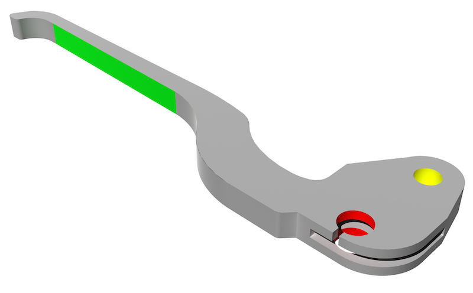
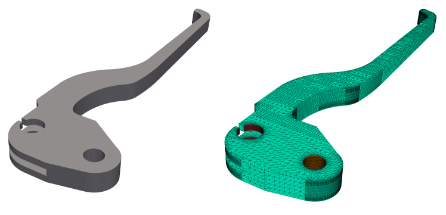
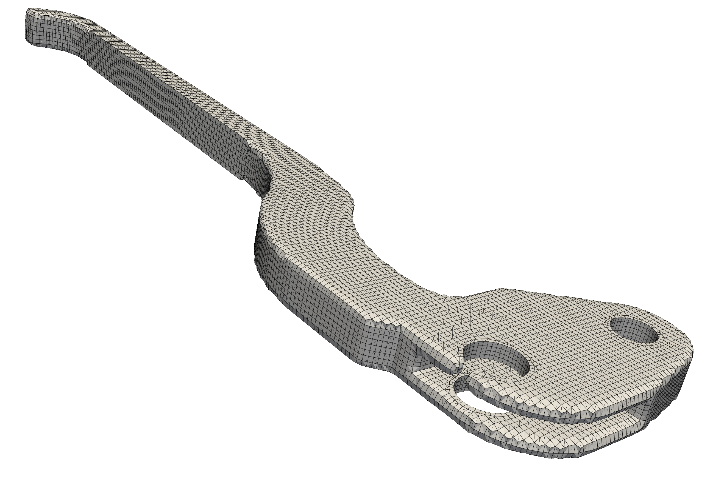
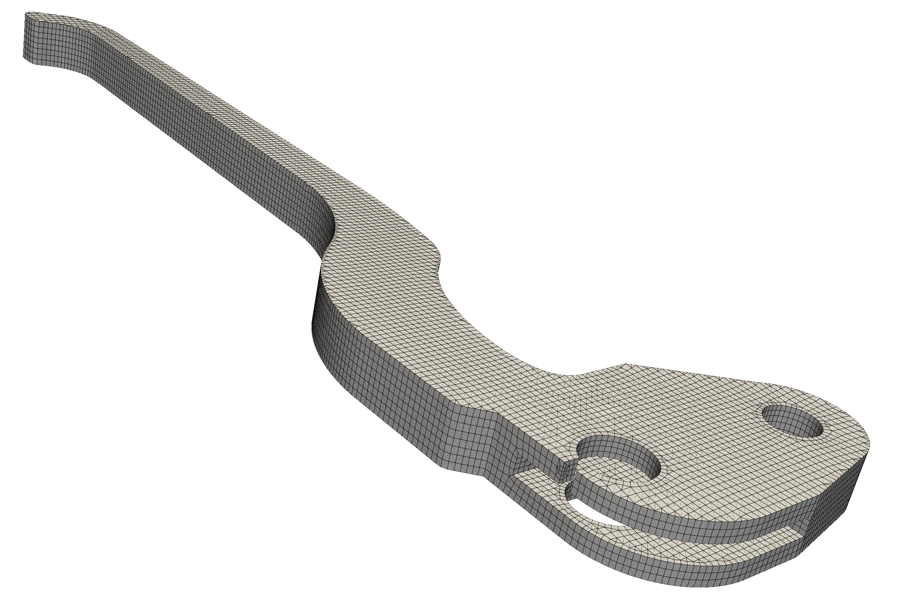
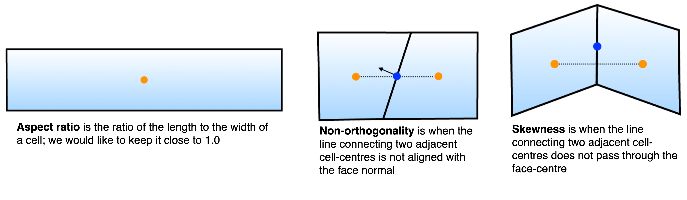
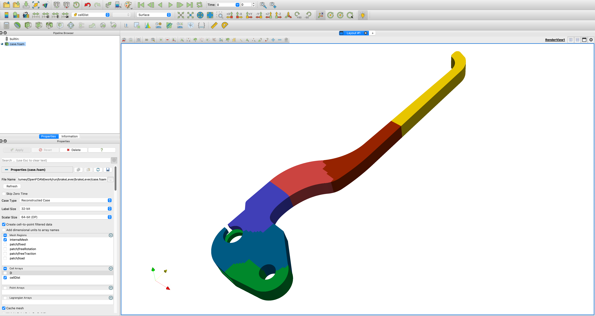
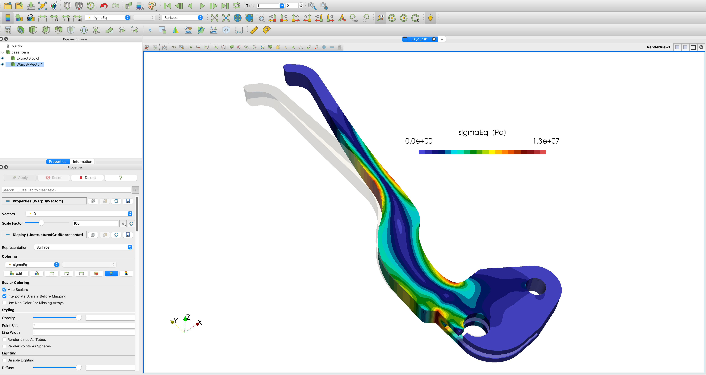

# Custom workflow tutorial: `brakeLever`

Prepared by: Ivan Batistić and Philip Cardiff

---

## Tutorial Aims

- Provide a step-by-step process for building a custom `solids4foam`
  case from scratch. Using a brake lever as the example, the tutorial covers the
  complete workflow: meshing, setting up the case files, running the solver, and
  post-processing the results.

## Prerequisites

Prerequisites for this tutorial are:

- `solids4foam-v2.2`
- `openfoam2312`
- `ParaView-5.13.2`

It is possible to follow the tutorial steps with other `OpenFOAM` and
`ParaView` versions, but be aware of possible minor differences.

## Problem description

This tutorial analyses a brake lever, as shown in the image below. The geometry
 has three key surfaces: a green surface where a load is applied, a yellow
 surface where a pin allows rotation, and a red surface where the cable end is
 attached. For this analysis, we will make the following assumptions:

- The red surface is fixed.
- A pressure of 50 kPa is applied to the green surface.
- The lever is made of aluminium with a Young's modulus of 70 GPa and a Poisson's
  ratio of 0.33.
- Gravitational effects are neglected.
- The analysis assumes small deformations and a linear elastic (Hookean)
  material response.



### Loading (green), fixed (red) and frictionless support (yellow) surfaces

## Step 1. Preparing case geometry

For convenience, we will set up the `SOLIDS4FOAM_DIR`
 variable to point to the `solids4foam` installation directory. Since this
 location is user-dependent, this will ensure that the subsequent commands are
 applicable to all users:

```bash
echo 'export SOLIDS4FOAM_DIR=<PATH_TO_SOLIDS4FOAM>'
```

where you should replace`<PATH_TO_SOLIDS4FOAM>` with the location
 of the solids4foam directory on your system. Optionally, make it permanent
 by adding it to `~/.bashrc`:

```bash
echo 'export SOLIDS4FOAM_DIR=<PATH_TO_SOLIDS4FOAM>' >> ~/.bashrc
source ~/.bashrc
```

Now, create a new directory for this case and navigate into it:

```bash
mkdir brakeLever
cd brakeLever
```

Download and unpack the geometry:

```bash
wget https://www.solids4foam.com/tutorials/archive/lever.zip \
  && unzip lever.zip && mv lever/* . \
  && rm -rf lever lever.zip
```

The geometry is provided in several `.stl` files, each representing a different
 boundary patch. We will combine them into a single file for the mesher:

```bash
cat *.stl > brakeLever.stl
```

Before meshing, it is a good practice to inspect the geometry in ParaView. The
 `touch` command creates a dummy file that allows ParaView to recognise the
 folder as an OpenFOAM case.

```bash
touch case.foam && paraview case.foam
```

Once ParaView opens, load the `brakeLever.stl` file using *File > Open...* to
 view the geometry.



### Case geometry (left) and geometry STL (right)

```tip
Before meshing, always inspect your STL files for flaws like gaps, overlapping
faces, sharp angles, non-manifold edges, or incorrect units. This can save you a
lot of trouble later.
```

```tip
When using `cat` to merge ASCII STL files for OpenFOAM, be aware that patch
 names are often embedded in the file itself (e.g., `solid patch_name ...
 endsolid patch_name`). Check that these names are correct before merging, as
 they will be used to define the boundary patches in the mesh.
```

## Step 2. Meshing using cfMesh

Before meshing, we must populate the case directory with the necessary
`OpenFOAM` files. The most efficient way to do this is to copy the structure
from a similar tutorial case. Since our simulation assumes small deformations
and a linear elastic material, the cases in
`solids4foam/tutorials/solids/linearElasticity` are a good starting point.
We will use the `plateHole` tutorial:

```bash
cp -r $SOLIDS4FOAM_DIR/tutorials/solids/linearElasticity/plateHole/* .
```

The `cfMesh` mesher comes with OpenFOAM (OpenFOAM.com) as a sub-module, so you
 You need to compile it before you can use it. This can be done with the
 following commands:

```bash
foam
cd modules
git submodule update --init cfmesh
cd cfmesh
./Allwmake
```

Once the compilation is successful, return to your `brakeLever` case directory.
 Meshing with `cfMesh` is controlled by the `system/meshDict` file. We will copy
 a suitable example from the `wobblyNewton` solids4foam tutorial:

```bash
cp $SOLIDS4FOAM_DIR/tutorials/solids/linearElasticity/wobblyNewton/ \
 system/meshDict system/
```

Next, let us check the geometry file. The `surfaceCheck` utility provides
 statistics about the surface triangulation and its bounding box.

```bash
surfaceCheck brakeLever.stl
rm -rf *.obj
```

```plaintext
Statistics:
Triangles    : 45064 in 4 region(s)
Vertices     : 22607
Bounding Box : (-30.3771 -24.3679 -4.5) (20.3966 169.632 4.5)

Region  Size
------  ----
fixed   4716
freeRotation    7226
freeTraction    31544
load    1578


Surface has no illegal triangles.
...
```

The output shows that the geometry is valid, but the bounding box dimensions
 suggest the units are in millimetres. We need to scale the geometry to meters
 for our simulation. We can do this with the `scaleSurfaceMesh` utility:

```bash
scaleSurfaceMesh brakeLever.stl brakeLever_scaled.stl 0.001
```

After scaling, we will convert geometry to `fms` format, after which we can
 remove all `stl` files:

```bash
surfaceToFMS brakeLever_scaled.stl
rm -rf *.stl
```

Now, we can adjust `system/meshDict` for our first meshing attempt. Set the
 following entries:

```plaintext
surfaceFile "brakeLever_scaled.fms";
maxCellSize 0.001;
boundaryCellSize 0.001;
```

Run the mesher and inspect the result in ParaView:

```bash
cartesianMesh
paraview case.foam
```



### Initial mesh

You will notice that the sharp edges of the geometry are rounded in
 the mesh. To improve this, we can extract the feature edges from the surface and
 instruct `cfMesh` to preserve them. Feature edge extraction is done
 using the command:

```bash
surfaceFeatureEdges -angle 30 brakeLever_scaled.fms brakeLever_scaled_edge.fms
```

which will extract all edges where the angle between adjacent faces is 30
 degrees or more. Before re-running the mesher, it is necessary to change the surface
 file name in `system/meshDict`:

```plaintext
surfaceFile "brakeLever_scaled_edge.stl";
```

With the feature edge file specified, run the mesher again and view the result:

```bash
cartesianMesh
paraview case.foam
```



### Mesh after using `surfaceFeatureEdges` utility to extract edges

The new mesh respects the geometry's sharp features much better. After a visual
 inspection, we should perform a formal quality check using the `checkMesh`
 utility:

```bash
checkMesh
```

From the output of `checkMesh`, we can see that the mesh passed the
 test and is OK for use:

```plaintext
...
Checking geometry...
        Overall domain bounding box (-0.0303905 -0.0243743 -0.00450006)
        (0.0203966 0.16956 0.00450007)
        Mesh has 3 geometric (non-empty/wedge) directions (1 1 1)
        Mesh has 3 solution (non-empty) directions (1 1 1)
        Boundary openness (6.16467e-16 -3.41217e-17 1.354e-16) OK.
        Max cell openness = 3.17123e-16 OK.
        Max aspect ratio = 8.35448 OK.
        Minimum face area = 2.98537e-08. Maximum face area = 1.96001e-06.
        Face area magnitudes OK.
        Min volume = 4.77543e-12. Max volume = 1.29557e-09.
        Total volume = 2.41888e-05. Cell volumes OK.
        Mesh non-orthogonality Max: 52.2587 average: 9.14128
        Non-orthogonality check OK.
        Face pyramids OK.
        Max skewness = 1.21589 OK.
        Coupled point location match (average 0) OK.
Mesh OK.
```

From the `checkMesh` output, we obtain the maximum values of mesh quality
 metrics such as aspect ratio, skewness, and non-orthogonality. All of these
 metrics are important, but for segregated solvers with semi-implicit
 discretisation, non-orthogonality is particularly critical. High
 non-orthogonality reduces the implicitness of the discretisation, which in turn
 decreases robustness and solver efficiency. Therefore, it should be kept as low
 as possible.



### `checkMesh`  mesh metrics explanation

```tip
For a more thorough check, run: `checkMesh -allGeometry -allTopology`.
 You can also add the `-writeAllFields` flag to save the mesh quality fields
 (like skewness and non-orthogonality) for visualisation in ParaView.
```

```tip
If `checkMesh` reports that the mesh is not OK, it must be improved.
 The severity of warnings is indicated by asterisks (*, **, ***), with *** being
 the most critical. You can adjust the warning thresholds for these metrics in a
 `system/meshQualityDict` file (add -meshQuality flag when runnig checkMesh).
 The default trehold values can be found at, for example,
 `OpenFOAM-v2312/src/OpenFOAM/meshes/primitiveMesh/
 primitiveMeshCheck/primitiveMeshCheck.C` file'
```

The mesh is written in `constant/polyMesh` directory in OpenFOAM format, using
 files `points`, `faces`, `owner`, `neighbour` and `boundary` file.
 After generating the mesh , one should always inspect
 `constant/polyMesh/boundary` file. The mesher often assigns the default `wall`
 type to all patches. For applying traction and displacement boundary conditions,
 these must be changed to the generic `patch` type.

```plaintext
4
(
fixed
{
    type patch;
    nFaces 332;
    startFace 86415;
}
freeRotation
{
    type patch;
    nFaces 360;
    startFace 86747;
}
freeTraction
{
    type patch;
    nFaces 10340;
    startFace 87107;
}
load
{
    type patch;
    nFaces 624;
    startFace 97447;
}
)
```

## Step 3. Preparing Case Files

With the mesh complete, we now need to configure the case files for
 the simulation.

### Boundary and Initial Conditions

First, open the `0/D` file to set the boundary and initial conditions for
 the displacement field `D`. We'll start with an initial condition of zero
 displacement for the entire domain:

```c++
internalField   uniform (0 0 0);
```

Next, we define the conditions for each boundary patch inside the
 `boundaryField` dictionary. The setup is as follows:

- **`fixed`**: Zero displacement is prescribed on this patch.
- **`freeRotation`**: This patch simulates a pin, allowing rotation but no
surface normal movement. We use a boundary condition that enforces zero normal
displacement and zero shear stress (tangential traction).
- **`freeTraction`**: This is a free surface with no applied forces.
- **`load`**: A pressure of 50 kPa is applied to this surface.

The final `0/D` file should look like this:

```c++
boundaryField
{
    fixed
    {
        type            fixedDisplacement;
        value           uniform (0 0 0);
    }
    freeRotation
    {
        type            fixedDisplacementZeroShear;
        value           uniform (0 0 0);
    }
    freeTraction
    {
        type            solidTraction;
        traction        uniform ( 0 0 0 );
        pressure        uniform 0;
        value           uniform (0 0 0);
    }
    load
    {
        type            solidTraction;
        traction        uniform ( 0 0 0 );
        pressure        uniform 50000;
        value           uniform (0 0 0);
    }
}
```

### Material and Solid Properties

Next, we need to adjust input dicts in the `constant` directory. Material
 properties are defined in `constant/mechanicalProperties`. We will specify
 the properties for aluminium:

```plaintext
planeStress     no;

mechanical
(
    aluminum
    {
        type            linearElastic;
        rho             rho [1 -3 0 0 0 0 0] 2700;
        E               E [1 -1 -2 0 0 0 0] 70+9;
        nu              nu [0 0 0 0 0 0 0] 0.33;
    }
);
```

In the `constant/solidProperties` file, we select the solid mechanics model and
 control the solver's behaviour. We will use the `linearGeometryTotalDisplacement`
 solver, which is a segregated solver for small strains and rotations.

```plaintext
// linearGeometry: assumes small strains and rotations
solidModel     linearGeometryTotalDisplacement;

"linearGeometryTotalDisplacementCoeffs"
{
    // Maximum number of momentum correctors
    nCorrectors     20000;

    // Solution tolerance for displacement
    solutionTolerance 1e-05;

    // Alternative solution tolerance for displacement
    alternativeTolerance 1e-05;

    // Material law solution tolerance
    materialTolerance 1e-05;

    // Write frequency for the residuals
    infoFrequency   100;
}
```

```tip
For a detailed explanation of the entries in the `solidProperties` dictionary,
 see the [hotSphere](https://www.solids4foam.com/tutorials/tutorial1.html)
tutorial.

For a list of the solid models currently available
 in `solids4foam`, check this [page](https://www.solids4foam.com/documentation/solid-models.html).
```

The other files in the `constant` directory (`physicalProperties`, `dynamicMeshDict`)
 can remain unchanged. The `g` file can be modified if you wish to include
 gravitational effects.

### Numerical Schemes and Run-Time Control

The discretisation schemes in `system/fvSchemes` are mostly suitable, but it is
 important to ensure they are compatible with your OpenFOAM version. Different
 versions may use different names for gradient schemes (e.g., `pointCellsLeastSquares`).
 The `solids4Foam::convertCaseFormat` command, which we will add to the `Allrun`
 script later, automatically handles these updates.

In `system/fvSolution`, we can set solver settings and relaxation factors.
 Applying a small amount of under-relaxation to the displacement field `D` can
 improve stability in some cases without significantly affecting
 convergence speed.

```c++
solvers
{
    D
    {
        solver          PCG;
        preconditioner  FDIC;
        tolerance       1e-09;
        relTol          0.05;
    }
}

relaxationFactors
{
    equations
    {
        // D    0.999;
    }

    fields
    {
         D       0.99;
    }
}
```

```note
In a segregated solver, the overall solution is reached through a series of
 outer correction loops. Within each of these loops, a linear solver is used to
 solve for the displacement field. It's inefficient to solve this inner system to
 a very tight tolerance, especially when the overall solution is still far
 from converged.

For this reason, a relatively loose relative tolerance (`relTol`) is used for
 the linear solver. A value of `0.1` is common. While a higher value would work
 here, we use `0.05` as it provides a smoother convergence behaviour for this
 specific problem.
```

Finally, in `system/controlDict`, we need to clean up the `functions` entry by
 removing `forceDisp1` and `plateHoleAnalyticalSolution1`, which were copied from
 the tutorial case. We can also adjust the `pointDisp` function to monitor the
 displacement at a specific point on our brake lever. You will need to choose a
 coordinate that lies on the lever's geometry.

```c++
functions
{
    pointDisp
    {
        type          solidPointDisplacement;
        point         (-0.01 0.165 0);
    }
}
```

## Step 4. Running the Case

We will run the case on multiple cores. The number of cores and decomposition
 method is set in `system/decomposeParDict`:

```c++
numberOfSubdomains 6;
method scotch;
```

To run the case, we will modify existing `Allrun` script. The script should look
 like this:

```bash
#!/bin/bash

# Source tutorial run functions
. $WM_PROJECT_DIR/bin/tools/RunFunctions

# Source solids4Foam scripts
source solids4FoamScripts.sh

# Check case version is correct
solids4Foam::convertCaseFormat .

# Run case in parallel
solids4Foam::runApplication decomposePar -cellDist
solids4Foam::runParallel solids4Foam
solids4Foam::runApplication reconstructPar
```

Make the script executable with the following command:

```bash
chmod +x Allrun
```

Now, you can run the entire simulation by simply executing the script:

```bash
./Allrun
```

To monitor residuals, we can open a new terminal and type the following
 command for live monitoring of the solver log file:

```bash
tail -f log.solids4Foam
```

```plaintext
Evolving solid solver
Solving the momentum equation for D
setCellDisplacements: reading cellDisplacements
    Corr, res, relRes, matRes, iters
    100, 0.0140041, 0.00915755, 0, 134
    200, 0.00660016, 0.00428296, 0, 146
    300, 0.00398494, 0.0029169, 0, 130
    400, 0.00329534, 0.0020852, 0, 137
    500, 0.00161131, 0.00166415, 0, 137
    600, 0.00148513, 0.00134746, 0, 138
    700, 0.00122678, 0.00107629, 0, 136
    800, 0.00143081, 0.000964108, 0, 139
    900, 0.000613834, 0.000810128, 0, 143
    1000, 0.000769182, 0.000691791, 0, 137
    1100, 0.000538599, 0.000636424, 0, 139
    1200, 0.000537587, 0.000558763, 0, 138
    1300, 0.000473058, 0.000502587, 0, 140
    1400, 0.000406682, 0.00044205, 0, 142
...
```

The solver log file is printing residuals as follows:

- `res`: This is residual of linear solver being used to solve system of equation.

- `relRes`: This is the relative residual, indicating the relative change in
the solution between two successive iterations.

- `matRes`: This column, which is zero here, is only used for non-linear
material models.

- `iters`: This is the number of iterations performed by the linear solver.

This case is dominated by bending, which presents a challenge for segregated
 solvers due to the strong coupling between displacement components. As a result,
 a higher number of outer correctors (`nCorr`) is required to reach
 convergence.

While the solver is running, you can inspect how the domain was decomposed by
 visualizing the `cellDist` field in ParaView. The field is generated using
 `-cellDist` flag when running `decomposePar` command.



### Computational domain decomposition, colours denote different processors

## Step 5. Analysing the Results

Once the simulation is complete, open the results in ParaView:

```bash
paraview case.foam
```

When viewing the results in ParaView, we will warp the geometry by a
 scaled displacement field, which can be achieved using the *Warp By Vector*
 filter, where the `D` displacement field is selected as the *Vector,* and a
 *Scale Factor* of 1 shows the true deformation. In this case, using a
 *Scale Factor* of 100 allows the deformation to be seen. To compare the deformed
 shape with the original geometry, you can use the *Filters > Alphabetical > Extract
 Block* filter to create a separate object for the undeformed lever and then
 reduce its opacity. This allows you to see both the original and deformed states
 simultaneously.



### Deformed geometry by resulting displacement (scaled by a factor of 100)
