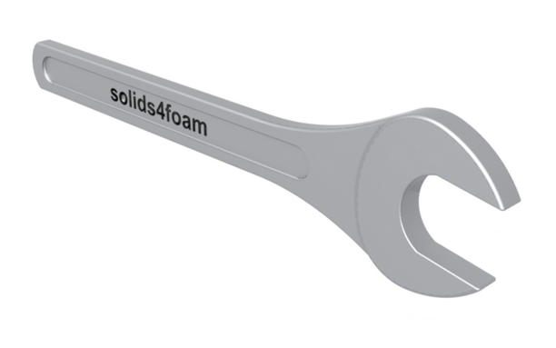
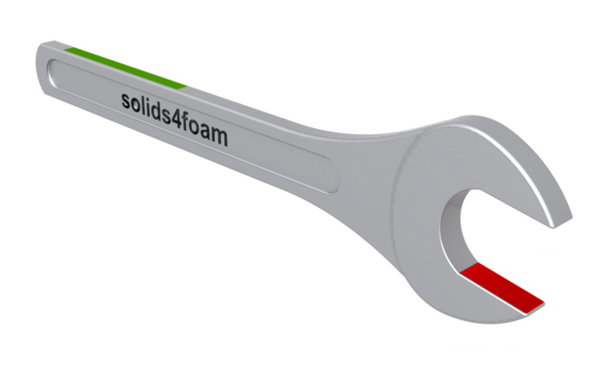
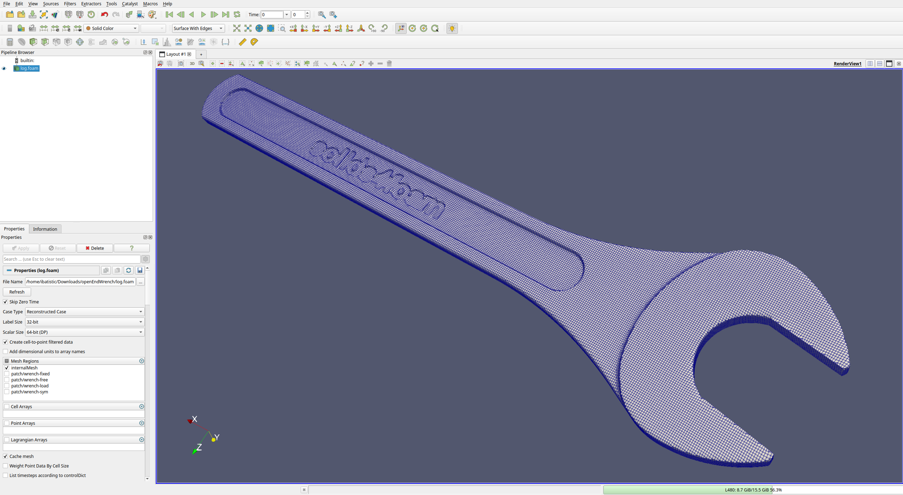
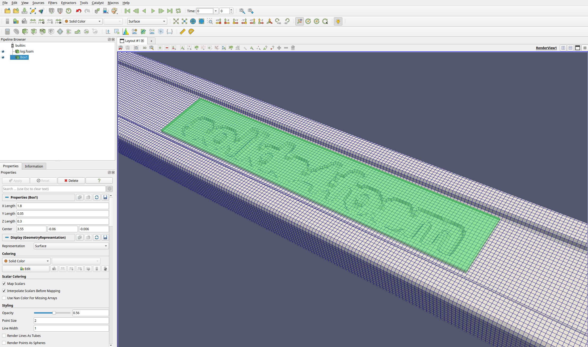
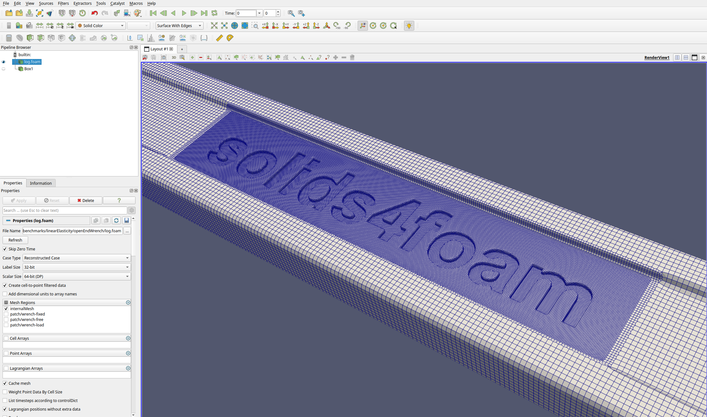
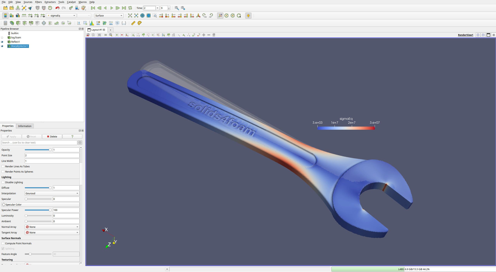

# My fifth tutorial: `openEndWrench`

Prepared by: Ivan Batistić and Philip Cardiff

---

## Tutorial Aims

This guide covers the step-by-step process of building a custom solid case
from scratch. It demonstrates how to generate the mesh for the provided
geometry, use the `cfMesh` mesh generator, set up patches for boundary
conditions, apply boundary conditions, solve the problem, and post-process the
results. We’ll use an "open-end wrench" as the example problem.

## Prerequisites

Prerequisites for this tutorial are:

- `solids4foam-v2.2`
- `openfoam2312`
- `ParaView-5.13.2`

It is possible to follow the tutorial steps with other `OpenFOAM` and
`ParaView` versions, but be aware of possible minor differences.

## Step 1. Preparing Case Geometry

Before using geometry for simulations, it is essential to ensure the geometry
is clean and free of flaws that could compromise mesh generation. Common flaws
to address include non-manifold edges, self-intersecting surfaces, gaps,
overlapping faces, sharp angles, improper units, disconnected bodies,
tolerance issues, etc. These can be resolved using CAD software.
In this example, geometry preparation was done using Rhino, but other software
such as Blender or Salome can also be used. The case geometry is an open-end
wrench, as shown in the figure below.



### Case geometry

For `cfMesh`, the prepared geometry should be exported in the `stl` format
(preferably written in the `ascii` format). Before exporting, it is advisable
to divide the surface so that each portion corresponds to the boundary
condition that will be applied later in the simulation. In this case, we
distinguish between the faces where zero displacement will be prescribed,
surfaces where the load will be applied and the symmetry surface. These surfaces
are shown in the image below, with the load surface marked in green, the symmetry
surface in blue, and the fixed displacement surface in red. Overall, this means
the wrench geometry is divided into four `.stl` files: `wrench-fixed.stl`,
`wrench-sym.stl`,  `wrench-free.stl`, and `wrench-load.stl`.

```tip
Note that only half of the geometry is the computational domain.
The symmetry of the geometry and loads allows us to model one-half of the
geometry, which saves computational time.
```



### Loading (green), fixed (red) and symmetry surfaces (blue)

```tip
When exporting geometry to stl format, you can control the fineness of the
surface triangulation. Make it fine enough to accurately describe the geometry,
but avoid creating an stl file that is too large, as this will
increase meshing time.
```

To download the geometry, first, we need  to open the terminal and
create a case directory at a location of your choice:

```bash
mkdir openEndWrench
cd openEndWrench
```

Next, download and unzip the geometry using the following command:

```bash
wget https://www.solids4foam.com/tutorials/archive/wrench.zip \
 && unzip wrench.zip && mv wrench/* . && rm -rf wrench wrench.zip
```

Before proceeding to the next phase, we will set up the `SOLIDS4FOAM_DIR`
variable to point to the `solids4foam` folder. Since this location is
user-dependent, this will ensure that the subsequent commands are
applicable to all users. You can add the `SOLIDS4FOAM_DIR` variable to your
`.bashrc` file with the following command, where you should replace
`<PATH_TO_SOLIDS4FOAM>` with the location of location of the solids4foam
directory on your system.

```bash
echo 'export SOLIDS4FOAM_DIR=<PATH_TO_SOLIDS4FOAM>' >> ~/.bashrc
source ~/.bashrc
```

## Step 2. Meshing using cfMesh

The cfMesh mesher comes with OpenFOAM (OpenFOAM.com) as a sub-module, so you
 need to compile it before being able to use it. This can be done with the
 following commands:

```bash
foam
cd modules
git submodule update --init cfmesh
cd cfmesh
./Allwmake
```

Before proceeding to the meshing phase, we must populate the case directory
with the necessary `OpenFOAM` folders and files. The most efficient way to do
this is by finding the most similar tutorial case and copying its structure.
For our simulation, which assumes small deformations and a linear elastic
material, the cases in `solids4foam/tutorials/solids/linearElasticity` are the
most suitable.  For this case, we will copy the case structure from the `plateHole`
tutorial case:

```bash
cp -r $SOLIDS4FOAM_DIR/tutorials/solids/linearElasticity/plateHole/* .
```

Meshing with cfMesh is controlled using the `meshDict` file. Since `cfMesh`
is included in the `OpenFOAM` distribution (at least for version `v2312`),
we can find examples of this file either in the `OpenFOAM` tutorials or in the
`solids4foam` tutorials:

```bash
cd $SOLIDS4FOAM_DIR
find . -name meshDict
```

which will result in the following files:

```bash
./tutorials/fluidSolidInteraction/microBeamInCrossFlow/system/fluid/meshDict
./tutorials/fluidSolidInteraction/microBeamInCrossFlow/system/solid/meshDict
./tutorials/solids/linearElasticity/wobblyNewton/system/meshDict
./tutorials/solids/linearElasticity/punch/system/punch_bottom/meshDict
./tutorials/solids/linearElasticity/punch/system/punch_top/meshDict
```

We will use the `meshDict` from the `wobblyNewton` tutorial case. The file
should be located under the `system` folder (locate your terminal in
`openEndWrench` directory):

```bash
cp $SOLIDS4FOAM_DIR/tutorials/solids/linearElasticity/wobblyNewton/\
 system/meshDict system/
```

If we open the `meshDict` file, we will see three entries.
The first one specifies the file to be meshed, the second defines the
maximum cell size, and the third controls the size on the boundary.

```plaintext
surfaceFile "newtonDecimated.stl";
maxCellSize 0.005;
boundaryCellSize 0.0025;
```

The next step is to prepare the file to be meshed. Since we have divided
our surface into three `stl` files, we need to combine them into one `stl`
file. Before combining, we must open each `stl` file and rename the beginning
and end of the file to match the `stl` name. For example for the `wrench-free`
file, we need to replace `OBJECT` in the first and the last
line with `wrench-free`.

```plaintext
solid OBJECT
  facet normal 0.17364834595052386 0 0.98480772333925526
    ...
 ...
 ...
   endloop
 endfacet
endsolid OBJECT
```

should looks like:

```plaintext
solid wrench-free
  facet normal 0.17364834595052386 0 0.98480772333925526
    ...
 ...
 ...
   endloop
 endfacet
endsolid wrench-free
```

You can automatically make these replacements with the following `bash` loop:

```bash
for file in wrench-*.stl
do
    name="${file%.stl}"
    sed -i "s/OBJECT/$name/g" "$file"
done
```

Now, we can combine the `stl` files into one `stl` file:

```bash
cat *.stl > wrench.stl
```

`cfMesh` prefers the `fms` format over the `stl` format, so we will
convert `stl` to`fms` using the following command:

```bash
surfaceToFMS wrench.stl
```

Now, we can adjust the `meshDict` and try to generate a mesh. Set the
entries in the `meshDict` as follows,

```plaintext
surfaceFile "wrench.fms";
maxCellSize 0.016;
boundaryCellSize $maxCellSize;
```

and run the mesher using the following command (after which we will use
`paraFoam` to visualise it):

```bash
cartesianMesh
paraFoam   # or 'touch case.foam && paraview case.foam'
```



One can see that the mesh size is sufficient to describe the geometry.
However, if we want to capture smaller features, such as the engraved letters,
we need to refine the mesh in that region. To do so, we can refer to the
`cfMesh` [user guide](https://cfmesh.com/wp-content/uploads/2015/09/User_Guide-cfMesh_v1.1.pdf),
which details the available meshing features. In this case, we will refine the
mesh within a box zone. To determine the box's centre and size, we can use
*Sources > Alphabetical > Box* in ParaView.



Now that we know the box dimensions we can add the refinement in the `meshDict` file:

```plaintext
surfaceFile "wrench.fms";
maxCellSize 0.016;
boundaryCellSize $maxCellSize;

objectRefinements
{
    box
    {
        type box;
        cellSize 0.0;
        centre (3.55 -0.06 -0.006);
        lengthX 1.8;
        lengthY 0.05;
        lengthZ 0.3;
    }
}
```

Afterwards, we will run the mesher again,

```bash
cartesianMesh
paraFoam
```

and check mesh in ParaView:



To check if the mesh is suitable for running,
we will use the `checkMesh` utility:

```bash
checkMesh
```

From the output of `checkMesh`, we can see that the mesh passed the
test and is OK for use:

```plaintext
Checking geometry...
    Overall domain bounding box (-0.693371 -0.137758 -0.832674)
     (5.8863 1.987e-08 0.784286)
    Mesh has 3 geometric (non-empty/wedge) directions (1 1 1)
    Mesh has 3 solution (non-empty) directions (1 1 1)
    Boundary openness (-1.9122e-18 3.4032e-14 -2.15079e-15) OK.
    Max cell openness = 3.39452e-16 OK.
    Max aspect ratio = 7.41112 OK.
    Minimum face area = 1.49903e-06. Maximum face area = 0.000593324.
     Face area magnitudes OK.
    Min volume = 5.80657e-09. Max volume = 4.96332e-06.  Total volume = 0.45235.
     Cell volumes OK.
    Mesh non-orthogonality Max: 52.4483 average: 4.18888
    Non-orthogonality check OK.
    Face pyramids OK.
    Max skewness = 1.85112 OK.
    Coupled point location match (average 0) OK.

Mesh OK.
```

From the `Overall domain bounding box` line, we can see that the bounding box
for our mesh is 6.5 meters in the x-direction, which suggests that we have
scaling issues. This typically happens when the mesh is created in millimetres
but exported in meters, or vice versa. In this example, the CAD model was
in inches, so we need to scale it by a factor of 0.0254 to convert
it to meters:

```bash
scaleMesh 0.0254
```

Additionally, the `checkMesh` output shows that the boundary patches correspond
to the names of the `stl` files, and we can use these patch names to set up
the boundary conditions in the `0` directory."

```plaintext
Checking patch topology for multiply connected surfaces...
                   Patch    Faces   Points  Surface topology
            wrench-fixed      659      747  ok (non-closed singly connected)
             wrench-free    70733    71725  ok (non-closed singly connected)
             wrench-load      478      600  ok (non-closed singly connected)
              wrench-sym    17603    18003  ok (non-closed singly connected)
```

The same patch names are written in the `constant/polyMesh/boundary` file,
which, in our case, looks like this:

```plaintext
4
(
wrench-fixed
{
    type wall;
    nFaces 659;
    startFace 1512428;
}

wrench-free
{
    type wall;
    nFaces 70733;
    startFace 1513087;
}

wrench-load
{
    type wall;
    nFaces 478;
    startFace 1583820;
}

wrench-sym
{
    type wall;
    nFaces 17603;
    startFace 1584298;
}

)
```

The type `wall` is used for fluid simulations. For solid simulations,
we need to replace it with the `patch` type for traction and displacement
boundaries and with `symmetry` for patches where symmetry
conditions are applied.

```plaintext
4
(
wrench-fixed
{
    type patch;
    nFaces 659;
    startFace 1512428;
}

wrench-free
{
    type patch;
    nFaces 70733;
    startFace 1513087;
}

wrench-load
{
    type patch;
    nFaces 478;
    startFace 1583820;
}

wrench-sym
{
    type symmetry;
    nFaces 17603;
    startFace 1584298;
}

)

```

The mesh is now ready, and we can proceed to the next step.

## Step 3. Preparing Case Files

First, we will open the `constant/mechanicalProperties` file to adjust
the material properties.

```plaintext
planeStress     no;

mechanical
(
    steel
    {
        type            linearElastic;
        rho             rho [1 -3 0 0 0 0 0] 7854;
        E               E [1 -1 -2 0 0 0 0] 200e+9;
        nu              nu [0 0 0 0 0 0 0] 0.3;
    }
);
```

 After inspecting the file, we can see that the properties match those
 of steel, so we can leave the file as it is.

In the `constant/solidProperties` file, we choose the solver type,
solution tolerances, and the maximum number of iterations per time step
(`nCorrectors`). More information regarding entries in`solidProperties`
can be found in the [`hotSphere`](https://www.solids4foam.com/tutorials/tutorial1.html)
tutorial case. The chosen solver is the same as in `plateHole` tutorial;
`linearGeometryTotalDisplacement`, which is a segregated solver for small
strains and rotations. For a list of the solid models currently available
in `solids4foam`, check this [page](https://www.solids4foam.com/documentation/solid-models.html).

```plaintext
// linearGeometry: assumes small strains and rotations
solidModel     linearGeometryTotalDisplacement;

"linearGeometryTotalDisplacementCoeffs"
{
    // Maximum number of momentum correctors
    nCorrectors     5000;

    // Solution tolerance for displacement
    solutionTolerance 1e-06;

    // Alternative solution tolerance for displacement
    alternativeTolerance 1e-06;

    // Material law solution tolerance
    materialTolerance 1e-05;

    // Write frequency for the residuals
    infoFrequency   100;
}
```

The remaining files, `physicalProperties`, `dynamicMeshDict`, and `g` in
the `constant` directory, can remain unchanged. For this type of solid
simulation, only the `g` file should be modified if we want to include
gravitational effects

Next, in the `0/D` file, we need to set up boundary and initial conditions.
For the initial conditions, we can assume zero displacement in all cells,
which is set up on line 21:

```c++
internalField   uniform (0 0 0);
```

Within the curly brackets of the `boundaryField` keyword, we need to set the
boundary condition for each patch. We need to apply pressure to the
`wrench-load` patch, zero displacement to the `wrench-fixed` patch,
and traction-free conditions to the remaining boundary, `wrench-free`.
Finally, the `0/D` file should look like this:

```c++
boundaryField
{
    wrench-fixed
    {
        type            fixedDisplacement;
        value           uniform (0 0 0);
    }
    wrench-load
    {
        type            solidTraction;
        traction        uniform ( 0 0 0 );
        pressure        uniform 5e5;
        value           uniform (0 0 0);
    }
    wrench-free
    {
        type            solidTraction;
        traction        uniform ( 0 0 0 );
        pressure        uniform 0;
        value           uniform (0 0 0);
    }
    wrench-sym
    {
        type            solidSymmetry;
        patchType       symmetry;
        value           uniform (0 0 0);
    }
}
```

The entries in `system/fvSchemes` fit our case, so we can leave them as they
are. In `system/fvSolution`, we can prescribe a small under-relaxation of the
solution field `D`. This under-relaxation will not notably impact the
convergence rate, but in some cases, it can help with calculation stability:

```c++
relaxationFactors
{
    fields
    {
        D       0.99;
    }
}
```

In the `system/controlDict`, we need to set `endTime` to 1, as we are solving a
 static simulation with one load increment and no time marching. The `forceDisp1`
 and `plateHoleAnalyticalSolution1` entries in `functions` should be removed, and
 for `pointDisp`, we can set the value to `(0.0055 0 0)` to monitor the wrench
 end deflection.

## Step 4. Running the Case

To run the case, we can use the existing `Allrun` script; however,
we need to modify it by removing the line that generates
the mesh using `blockMesh`.  To run the case in parallel
the `Allrun` script should look like this:

```bash
#!/bin/bash

# Source tutorial run functions
. $WM_PROJECT_DIR/bin/tools/RunFunctions

# Source solids4Foam scripts
source solids4FoamScripts.sh

# Check case version is correct
solids4Foam::convertCaseFormat .

# Run solver in parallel
solids4Foam::runApplication decomposePar
mpirun -np 4 solids4Foam -parallel > log.solids4Foam
solids4Foam::runApplication reconstructPar

```

We can start the modified `Allrun` script with the command:

```bash
./Allrun
```

To monitor residuals, we can open a new terminal and type the following
command for live monitoring of the solver log file:

```bash
tail -f log.solids4Foam
```

Now the solver is running and will take some time (~4 hours) as the mesh
size is notable. In the meantime, we can check how the case is decomposed,
i.e., which processors are solving which parts of the domain,
by transforming each processor domain into a `vtk`
file using the following commands:

```bash
foamToVTK -case processor0
foamToVTK -case processor1
foamToVTK -case processor2
foamToVTK -case processor3
```

The generated `vtk` files can be opened in ParaView by choosing
_File > Open* and selecting the file `_processor_0_procNumber.vtk`
file located in the processor directory.

The decomposition for this case is shown in the figure below.
One can observe that the purple and green processor domains are smaller
; however, this region contains a finer mesh for the engraved letters,
resulting in an overall balanced load on all CPUs.


### Computational domain decomposition, colours denote different processors

## Step 5. Analysing the Results

When viewing the results in ParaView, we can first mirror the computational
domain to obtain the full one by choosing *Filters > Alphabetical > Reflect*
and mirroring around the Y plane. Afterwards, we can warp the geometry by a
scaled displacement field, which can be achieved using the *Warp By Vector*
filter, where the `D` displacement field is selected as the *Vector,* and a
*Scale Factor* of 1 shows the true deformation. In this case, using a
*Scale Factor* of 100 allows the deformation to be seen.



### Deformed geometry by resulting displacement (scaled by factor of 100)
